

  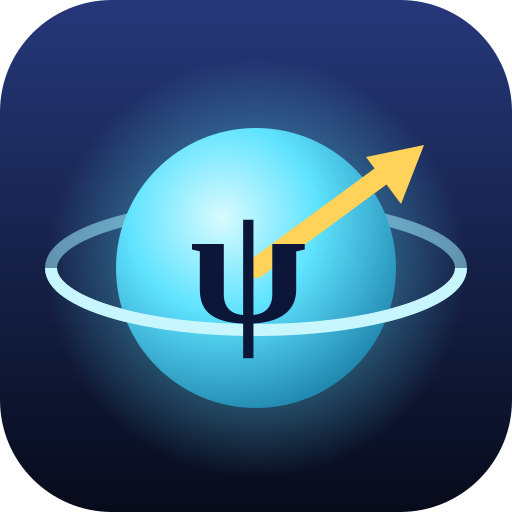

<h1 align="center">Little Psi in the Quantum World</h1>

  <i>Psíčko v kvantovom svete · Псічко у квантовому світі</i> 
  A 3D browser game for building <b>intuition</b> about quantum mechanics: its language, symbols, the right pictures and the typical misconceptions — not calculations.

  
  
  
  
  
  
  

> [!IMPORTANT]
> **The lectures are your primary learning resource.** This game is only a supplement and is likely to contain errors — please verify everything you learn in it against the lecture materials.

  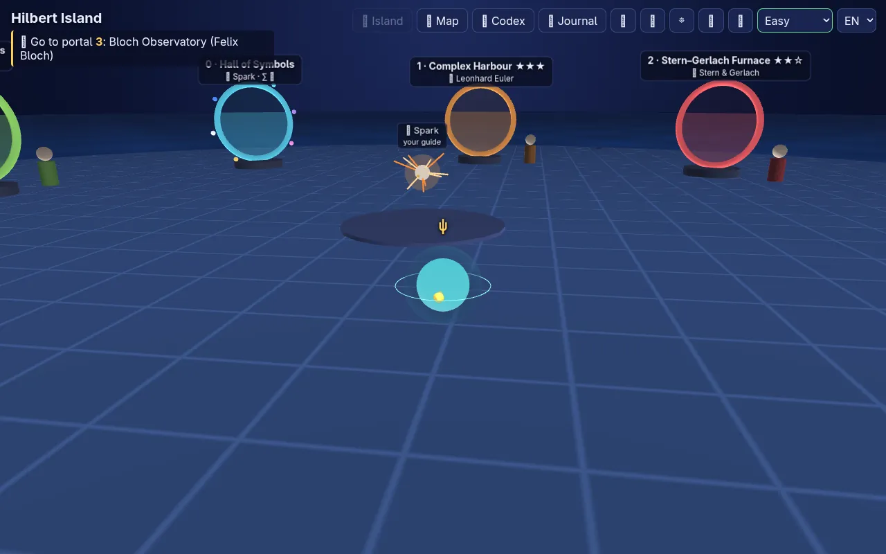
  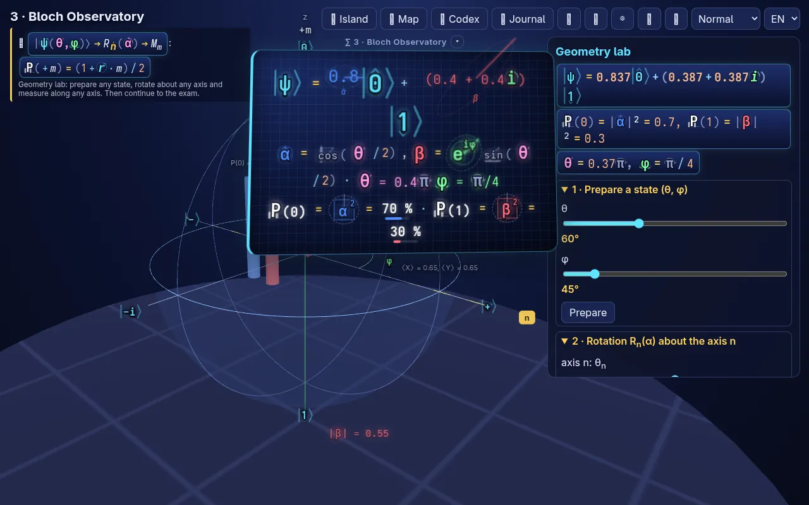
  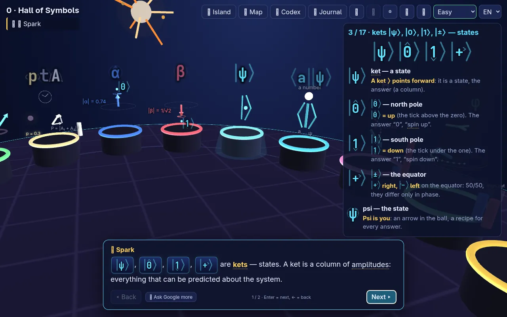
  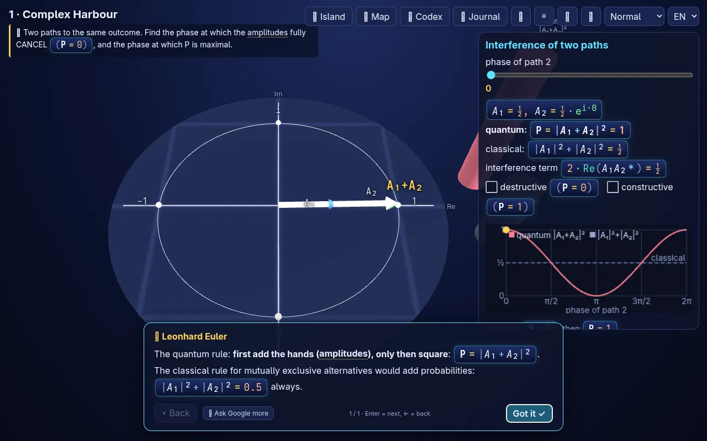

## Contents
- [Play](#play)
- [Screenshots](#screenshots)
- [What the game teaches](#what-the-game-teaches)
- [Choices on the welcome screen](#choices-on-the-welcome-screen)
- [Equation glyphs](#equation-glyphs)
- [Levels](#levels)
- [Controls](#controls)
- [Languages and dialogue files](#languages-and-dialogue-files)
- [Project structure](#project-structure)
- [License](#license)
- [Changelog](#changelog)

## Play
Double-click `index.html` (Chrome, Edge or Firefox). No server, build or install is needed — WebGL2 (OpenGL ES 3.0) with no libraries.
Progress, settings, the Codex and the Journal are saved in the browser (`localStorage`), so after a reload the game continues exactly where you left off; for a few seconds a **🗑 Start over** button is offered as well.

On the first start (and after a reset) a two-step welcome screen appears:

1. **Gameplay style** and **Difficulty** → *Next ▸*
2. **History**, **Equations** and **Levels** → *◂ Back* / *▶ Start the game*

Everything can be changed later in the settings (⚙).

## Screenshots
| | |
|---|---|
| 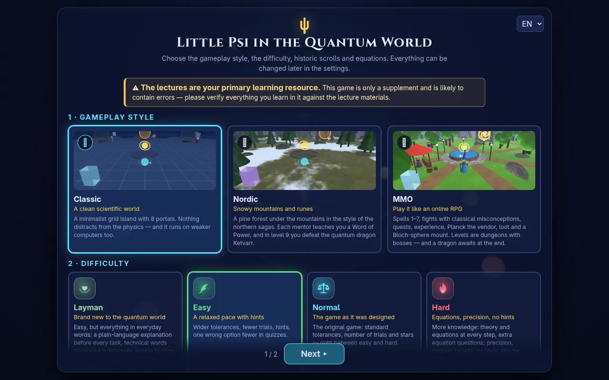 | 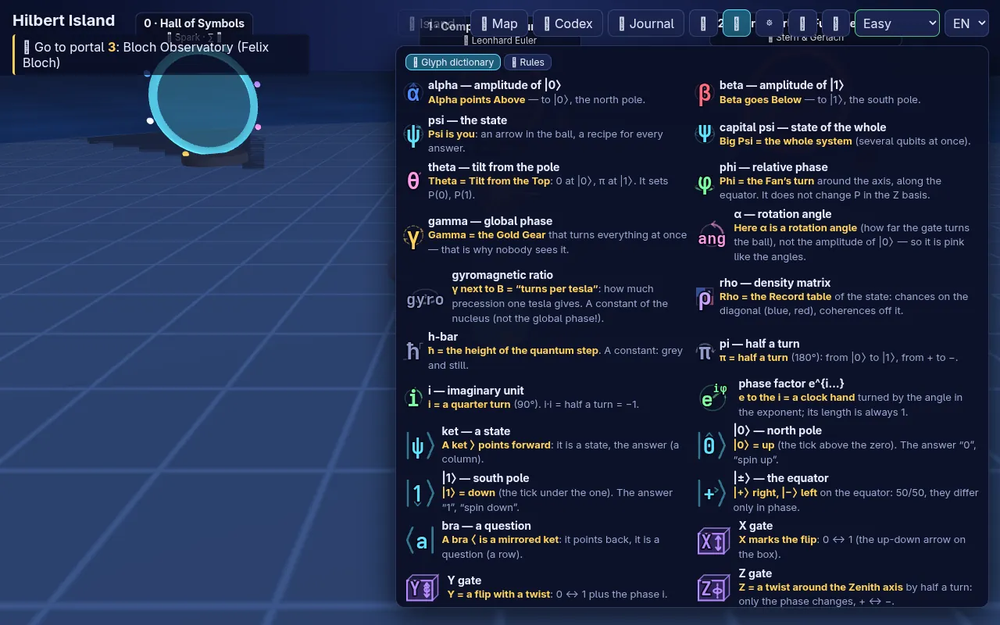 |
| **Welcome screen** — gameplay style, difficulty, history, equations, levels | **🔑 Key** — glyph dictionary first, mnemonic rules second |
| 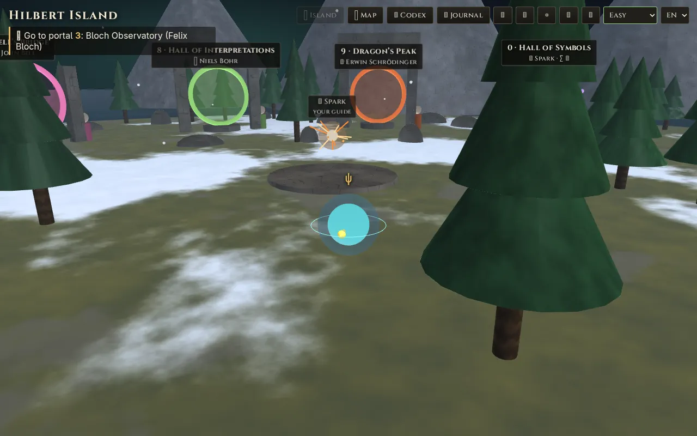 | 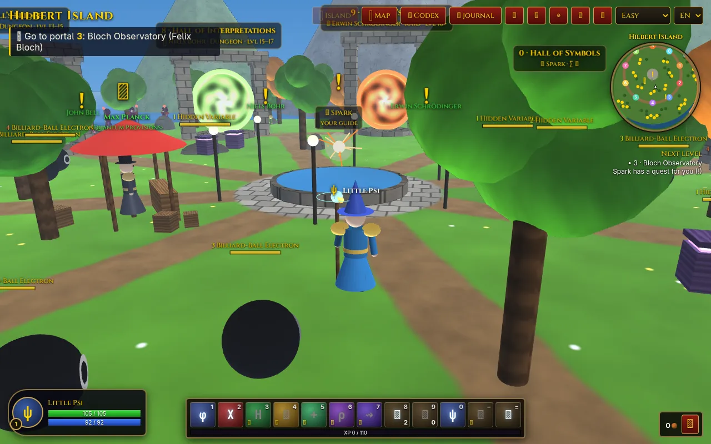 |
| **Nordic style** — snowy island and the dragon's peak | **MMO style** — spells, quests, a vendor and dungeons |
| 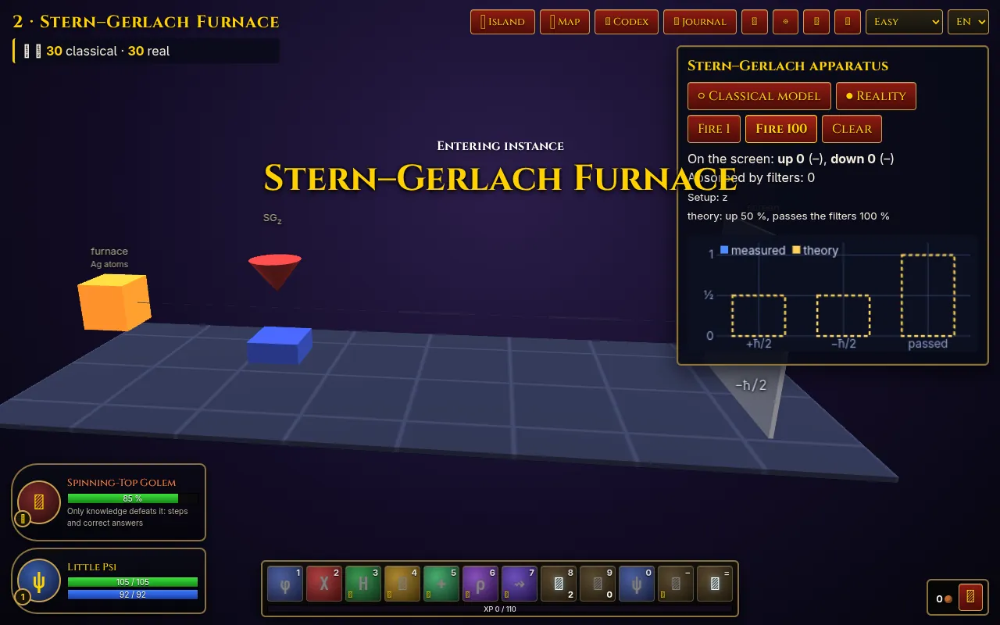 |  |
| **MMO dungeon** — the level boss loses health with every step and correct answer | **Hall of Symbols** — 17 animated 3D exhibits of the equation symbols |

## What the game teaches
You play **Little Psi**, the quantum state ψ — not a little ball with a position, but a *rule for predictions*. Your guide **Spark** (✨ a spark of light, deliberately unlike any amplitude symbol) waits in the middle of **Hilbert Island**. All portals stand in one ring around the centre; behind each one a mentor teaches one topic of lectures 1–3 through small experiments, dialogues and quizzes. Every level ends with **language traps** — a quiz about correct wording, because many mistakes in quantum physics are made with words, not with calculations.

- Amplitudes are clock hands; probability is the squared length; the phase only matters when amplitudes meet (interference).
- Measurement asks a question in a chosen basis; the global phase is unobservable, the relative phase is not.
- Gates are rotations of the Bloch ball; mixtures live inside it; decoherence erases the off-diagonal of ρ.
- Bra-ket grammar, NMR and Rabi oscillations, entanglement and the CHSH game, and the interpretations of quantum mechanics.

Correct answers **snap into place**: once an input is accepted (an arrow on its target, a π pulse, the optimal CHSH angles…), the slider and the 3D picture glide exactly onto the correct value.

## Choices on the welcome screen
### 1 · Gameplay style
| Style | |
|---|---|
| **Classic** (default) | the original blue grid island with 8 portals — nothing distracts from the physics, runs on weaker computers |
| **🐉 Nordic** | a snowy island with pines and standing stones, Nordic lettering and detailed procedural textures; every mentor teaches a *Word of Power* and level 9 is a turn-based battle with the quantum dragon **Ketvarr** |
| **⚔ MMO** | plays like an online RPG: a quantum mage with levels, a spell bar (X and H gates, the Born blade = measurement…), *classical misconceptions* as neutral enemies whose shields are qubits, quests, a vendor (Max Planck), bags and loot; levels are dungeons with bosses, and the dragon is a raid |

### 2 · Difficulty
Can be changed at any time from the selector in the top-right corner — the open dialogue, quiz and task text update immediately.

- **🫶 Layman** — everything in everyday words: an "in plain words" card before every task, technical words translated in brackets, simple tooltips.
- **Easy** (default) — wider tolerances, fewer trials, hints, one wrong option fewer in quizzes.
- **Normal** — the original game.
- **Hard** — theory and equations at every step, extra equation questions, dense texts without analogies, random targets, no hints, stricter stars.

### 3 · History
**📜 Historic scrolls** (off by default): before level steps a scroll unrolls with the history of the discoveries — years, authors, their conversations and famous words — and every level ends with one history question. Collected scrolls stay in the Codex.

### 4 · Equations
- **🖼 Mainly Human Language** — the picture and intuition come first (hands, the Bloch ball, experiments); equations live in the 📐 theory panel and the Journal.
- **∑ Equation Language (Experimental)** (default) — the real equation that holds right now is shown at the top of the screen and changes as you play; every task starts with its "∑ Equation first" card; all symbols are drawn as glyphs (below); adds **portal 0 — the Hall of Symbols** (17 pedestals, each symbol as a small 3D experiment, with a question after each one, a review after each chapter and a final exam).

### 5 · Levels
**Step by step** (default — the next portal opens after the previous level) or **Unlock everything** (all portals open right away, e.g. for teachers or revision). Unlocking and resetting are also available at the bottom of the help (H) and settings (⚙) panels.

## Equation glyphs
In the Equation Language every symbol becomes an SVG glyph that carries its meaning: **colour = who** it is, a **pictogram behind the letter = what it does**, and the **frame shape = what kind** of object it is. Hover a glyph for its name, a memory phrase and the pictogram on its own; the 🔑 key (top right, key **K**) holds the full glyph dictionary and the mnemonic rules. The files below are exported from the game (`docs/glyphs/`).

  
  
  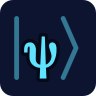
  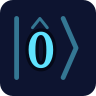
  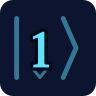
  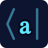
  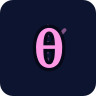
  
  
  
  
  
  
  
  
  

| Glyph | Meaning | Memory phrase |
|---|---|---|
| α, β | amplitudes of \|0⟩ (blue) and \|1⟩ (red) | *Alpha points Above, Beta goes Below* |
| \|ψ⟩, \|0⟩, \|1⟩ | kets — states; the frame ⟩ points forward | the tick shows the pole |
| ⟨a\| | bra — a question; the mirrored frame | ⟨a\|ψ⟩ is one number |
| θ, φ, γ | tilt (pink), relative phase (green), global phase (gold) | *Tilt from the Top, the Fan's turn, the Gold Gear* |
| H, X, … | operators — 3D boxes acting to the right | *X marks the flip, H = Halfway swap* |
| P, \|α\|² | probability — a white pillar; the frame freezes the phase | *frame it and freeze it* |

## Levels
| # | Level | Mentor | Topic |
|---|---|---|---|
| 0 | Hall of Symbols *(Equation Language only)* | Spark | what every symbol in the equations means |
| 1 | Complex Harbour | Leonhard Euler | amplitude as a clock hand, phase, i² = −1, interference |
| 2 | Stern–Gerlach Furnace | Otto Stern & Walther Gerlach | two spots, ±ħ/2, sequential measurements Z → X → Z, cos²(θ/2) |
| 3 | Bloch Observatory | Felix Bloch | gates X, Y, Z, H, S, T as rotations, relative vs. global phase, measurement, geometry lab |
| 4 | Temple of Interference | Richard Feynman | H·H vs. H·measurement·H, density matrix ρ, coherences, decoherence |
| 5 | Dirac's Library | Paul Dirac | bra-ket grammar: state, question, number, operator, probability |
| 6 | Rabi's Resonator (NMR) | I. I. Rabi | precession, rotating frame, π and π/2 pulses, resonance, T₂ |
| 7 | Bell's Bridge | John Bell | Bell state, reduced states, no-signalling, the CHSH game |
| 8 | Hall of Interpretations | Niels Bohr (+ Kant, Wittgenstein, Stodola, Bohm, Heisenberg, Noether) | collapse, complementarity, interpretations |
| 9 | Dragon's Peak *(Nordic and MMO styles)* | Erwin Schrödinger | turn-based battle: the dragon's ward is a qubit, a strike is a measurement with P = ½(1 + r·n) |

Stars depend on the number of mistakes. New Codex cards (symbols, people, concepts, scrolls and every task's **∑ equation**) unlock as you play.

## Controls
| Key | Action |
|---|---|
| WASD / arrows | move around the island (Shift = faster) |
| mouse drag, wheel | camera |
| E | enter a portal / talk |
| Enter, Space · ← / Backspace | next / back in a dialogue |
| L | Journal — every conversation, task equation (∑) and quiz explanation; read or replay |
| C | Codex — symbols, people, concepts, scrolls, equations |
| K | 🔑 key — glyph dictionary and mnemonic rules (Equation Language; unavailable during conversations) |
| V | 👁 views — the same state as clock hands, Bloch cuts, bases and the ρ matrix |
| M · H · O · Esc | map (click a portal to travel) · help · settings · close windows |
| 1 – = | spells (MMO style) · B bags · Tab target · Space jump |
| F9 | unlock all levels |

Hover anything (button, symbol, 3D object, underlined term) for a short explanation. Controls that do nothing at the moment (e.g. spells or panel buttons while a dialogue is open) are shown greyed out.

## Languages and dialogue files
The game is in **Slovak, English and Ukrainian**. Without a saved choice, Czech and Slovak browsers get SK, browsers with Ukrainian, Russian or Belarusian among their languages get UA, and everyone else EN. Switch with the selector in the top-right corner or on the welcome screen.

All dialogue text — conversations, quizzes, language traps, "in plain words" cards, theory, scrolls and quests — lives in `lang/sk.csv`, `lang/en.csv` and `lang/uk.csv` (columns `key,text`; a missing translation falls back to English). The code reads them with `DL('key', values…)`.

- **Equations are written in double square brackets** — this tells the game where to draw the equation background: `[[P = |α|²]]` inside a sentence becomes an inline chip, `[[…]]` on a line of its own becomes an equation block. Matrices are written `[0, 1; 1, 0]` so they don't clash with the brackets.
- `{0}`, `{1}` … are values filled in by the game (counts, percentages, names); a translation may move them.
- After editing a CSV run `node tools/build-lang.js`. It regenerates `lang/*.js` (browsers refuse to read CSV files when the game is opened from disk) and checks the `[[ ]]` brackets and `{n}` placeholders. When served over http(s) the game reads the CSV files directly.
- Interface strings (buttons, HUD, tooltips, Codex) stay in the code as `tr('slovensky', 'English', 'українською')`.

## Project structure
| Path | Contents |
|---|---|
| `index.html`, `style.css` | page, help, themes, welcome screen |
| `js/main.js` | game loop, island (hub), portals, base `Level` class, saving |
| `js/levels/*.js` | levels 0–9; `registry.js` sets their order |
| `js/ui.js` | dialogues, quizzes, Journal, Codex, settings, tooltips |
| `js/gl.js` · `js/math.js` · `js/quantum.js` | WebGL2 renderer and procedural meshes · vectors, matrices, complex numbers · 1- and 2-qubit simulator |
| `js/eqglyphs.js` · `js/eqmnemo.js` | SVG equation glyphs and `[[…]]` rendering · live equation and the 🔑 key |
| `js/i18n.js` · `lang/` · `tools/build-lang.js` | language choice, `tr()` and `DL()` · dialogue CSV files · CSV → JS generator and checker |
| `js/knowledge.js` · `js/content.js` · `js/scrolls.js` · `js/layman.js` | theory and equations · Codex and language traps · historic scrolls · layman cards and glossary |
| `js/views.js` · `js/tips.js` · `js/audio.js` · `js/wow.js` · `js/welcome.js` · `js/settings.js` | 👁 views · tooltips · generative music and sound effects · MMO style · welcome screen · settings |
| `assets/` · `docs/` | icons, theme pictures · README screenshots and exported glyph SVGs |

## License
[MIT](LICENSE) © 2026 Ondrej Špánik

## Changelog
Built from the commit history (newest first).

### 2026-10-10
- [`732fa4f`](https://github.com/iairu/QUANTUM_GAME/commit/732fa4f) Easy is the default difficulty and Equation Language the default game type; task equations in the Codex; fixed the selection border of the game-type cards; temporary "Start over" button when continuing a game
- [`ef294fa`](https://github.com/iairu/QUANTUM_GAME/commit/ef294fa) Unlock all levels and Reset game at the bottom of the settings as well
- [`039a4b7`](https://github.com/iairu/QUANTUM_GAME/commit/039a4b7) Welcome-screen notice: the lectures are the primary learning resource
- [`8abfe1c`](https://github.com/iairu/QUANTUM_GAME/commit/8abfe1c) Task equations in the Journal in both game types; two-slide welcome screen with an "Unlock everything" choice
- [`422fc9a`](https://github.com/iairu/QUANTUM_GAME/commit/422fc9a) Updates
- [`93b1c02`](https://github.com/iairu/QUANTUM_GAME/commit/93b1c02) History (historic scrolls) separate from difficulty; welcome screen update
- [`a099a7f`](https://github.com/iairu/QUANTUM_GAME/commit/a099a7f) Improvements
- [`c40f099`](https://github.com/iairu/QUANTUM_GAME/commit/c40f099) Correct inputs snap into the exact state
- [`c81f684`](https://github.com/iairu/QUANTUM_GAME/commit/c81f684) Updated welcome-screen visuals for the game type
- [`bc51d08`](https://github.com/iairu/QUANTUM_GAME/commit/bc51d08) Renamed the game types; dialogue adjustments
- [`4868b79`](https://github.com/iairu/QUANTUM_GAME/commit/4868b79) Adjusted the glyph and key approach
- [`9795bdb`](https://github.com/iairu/QUANTUM_GAME/commit/9795bdb) Better key location; disabled buttons are shown as such during dialogues
- [`41a41cd`](https://github.com/iairu/QUANTUM_GAME/commit/41a41cd) Glyph tooltips show the pictogram separately
- [`cd46e7e`](https://github.com/iairu/QUANTUM_GAME/commit/cd46e7e) Dialogue moved to CSV translation files with generated JS

### 2026-10-09
- [`6da6dc7`](https://github.com/iairu/QUANTUM_GAME/commit/6da6dc7) Improvements to the mnemonic version
- [`835ad3b`](https://github.com/iairu/QUANTUM_GAME/commit/835ad3b) Improved equation backgrounds and colours
- [`aca7afd`](https://github.com/iairu/QUANTUM_GAME/commit/aca7afd) Bigger equation display with mnemonics
- [`cfa7fa5`](https://github.com/iairu/QUANTUM_GAME/commit/cfa7fa5) More equation mnemonics
- [`b0bb51b`](https://github.com/iairu/QUANTUM_GAME/commit/b0bb51b) Live equations
- [`f0ce1d6`](https://github.com/iairu/QUANTUM_GAME/commit/f0ce1d6) Ukrainian translation
- [`f557568`](https://github.com/iairu/QUANTUM_GAME/commit/f557568) Welcome setup wizard

### 2026-10-08
- [`dc72d04`](https://github.com/iairu/QUANTUM_GAME/commit/dc72d04) Fast-changing numbers are easier to read
- [`3e9b5e6`](https://github.com/iairu/QUANTUM_GAME/commit/3e9b5e6) Larger panel text
- [`7f18729`](https://github.com/iairu/QUANTUM_GAME/commit/7f18729) "Ask Google AI" button in dialogues
- [`fccb2c0`](https://github.com/iairu/QUANTUM_GAME/commit/fccb2c0) Removed dialogue keys
- [`bb20ed8`](https://github.com/iairu/QUANTUM_GAME/commit/bb20ed8) Custom cursor, hidden while rotating the camera
- [`75a8efb`](https://github.com/iairu/QUANTUM_GAME/commit/75a8efb) MMO-style gameplay
- [`8848080`](https://github.com/iairu/QUANTUM_GAME/commit/8848080) Music volume off is truly silent (reverb routed through the volume); quieter 15 % default
- [`2d3f005`](https://github.com/iairu/QUANTUM_GAME/commit/2d3f005) Theme selector: Classic (8 levels) and Nordic (Skyrim look + dragon level 9); music and sound effects in both
- [`c756187`](https://github.com/iairu/QUANTUM_GAME/commit/c756187) Music, sound effects, better textures depending on computer performance
- [`b67baed`](https://github.com/iairu/QUANTUM_GAME/commit/b67baed) Nordic (Skyrim-style) look
- [`d3ddc94`](https://github.com/iairu/QUANTUM_GAME/commit/d3ddc94) Teleport mid-dialogue; Layman as the default difficulty
- [`cfe7805`](https://github.com/iairu/QUANTUM_GAME/commit/cfe7805) Hotfix: labels per difficulty
- [`88a22be`](https://github.com/iairu/QUANTUM_GAME/commit/88a22be) Layman version added to the difficulty selector
- [`4387991`](https://github.com/iairu/QUANTUM_GAME/commit/4387991) WASD hint and teleport through the map
- [`d535264`](https://github.com/iairu/QUANTUM_GAME/commit/d535264) Banner, favicon and metadata
- [`425fe1c`](https://github.com/iairu/QUANTUM_GAME/commit/425fe1c) Update
- [`55bc677`](https://github.com/iairu/QUANTUM_GAME/commit/55bc677) Difficulty updates; "ancient" difficulty with scrolls of knowledge
- [`2b968b3`](https://github.com/iairu/QUANTUM_GAME/commit/2b968b3) Difficulties, localStorage save, reset button
- [`830d16e`](https://github.com/iairu/QUANTUM_GAME/commit/830d16e) Slovak and English (i18n); unlock the whole game from the help section
- [`4c941e1`](https://github.com/iairu/QUANTUM_GAME/commit/4c941e1) v1: lectures 1–3 as a game world
